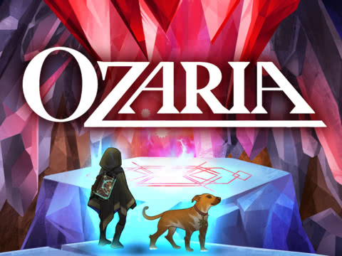

# Impacts on Society

This document describes a plan for the implementation on societies impacts by computation for a course to be implemented at Chico Country Day School. The plan for implementing the class overall can be found here: https://cs-ed.github.io/edtech-plan-NHunsicker/

  
  

## Context

The proposed course is tentatively titled **Introduction to Programming**. This title is a work in progress and I'll be working on braingstorming a more dynamic course title. This course will introduce students to algorithms and programming in the python language using the **Ozaria** curriculum from **Code Combat** as an elective. This course will meet on average three times per week for an entire school year. This course will be aimed at **middle shcool students** with a particular emphasis on students in **grades 7 and 8**.

These lessons will fall into the second type of lesson found in the edtech plan linked above and repeated below: 
>Some lessons will have students working in groups to research ideas and concepts. These groups will then bring their findings back to the class for discussion. During this period of time students will be using chromebooks to do this research. It is anticipated that students will start with google, google scholar, or wikipedia and branch into other sources as necessary during this time. During this period of time the teacher will monitor go guardian for off task behaviors while also moving between groups to help guide discussions.

At the time of writing we do not yet have a license to access the full curriculum, but the pacing guide indicates that there are **5 lessons on the impacts of computing** in the curriculum across the school year with each lesson lasting 1 or 2 days. This document will outline how just the first lesson, **How technology solves and creates problems** will be implemented over the course of two class sessions in the fourth week of class. The other lessons on **impacts of computing** are titled:
- How technology affects different careers
- Cybersecurity
- Accessibility
- Bias and Stereotypes

## Plan

### Learning Objectives

The California standard most closely aligned with the content of this lesson is **K-2.IC.18** which is **Compare how people lived and worked before and after the adoption of new computing technologies.** However, the lesson is modeled around the CSTA standard **1B-IC-18** which is **Discuss computing technologies that have changed the world, and express how those technologies influence, and are influenced by, cultural practices.**

The specific learning objectives of this lesson will be:
- Identify a computing advancement
- Give examples of problems that the chosen computing advancement solved
- Infer problems that the chosen computing advancement may have created

### Learning Activities

The described learning activity will be broken down into **8 separate steps** to be completed over **2 or 3 class session**. The other 3 impacts of computing lessons will follow a similar structure, but will likely be broken down into a different number of steps and will have different learning objectives associated with the particular topics of those lessons.

1. As a whole class we will replay the module from chapter 1 titled "A Better World". This module describes what coding was used for in the world of Ozaria. This will serve as an introduction to this lesson.
2. As a class we will discuss the following questions:
- How was coding once used in Ozaria?
- How do we think it was forgotten?
- Is coding and technology used the same way in the real world?
3. We will go over the assignment as whole class before breaking up into groups of 2 to 4 students. The group size will depend on the number of students present during the lesson, with a goal of having approximately 5 total groups.
4. Students will visit the following websites to complete their research for this lesson:
- [History of Computing Timeline](https://www.computerhistory.org/timeline/)
- [Computer History Timeline](https://www.softschools.com/timelines/computer_history_timeline/20/)
- [Computers Changed History](https://www.bookyourdata.com/email-list-database/computers-changed-history)
- [Rise of Smartphones](https://www.sciencemuseum.org.uk/objects-and-stories/computer-your-pocket-rise-smartphones)
- [Evolution of Gaming](https://techcrunch.com/2015/10/31/the-history-of-gaming-an-evolving-community/?guccounter=1&guce_referrer=aHR0cHM6Ly93d3cuZ29vZ2xlLmNvbS8&guce_referrer_sig=AQAAABgw5eqX1jXxZtTZd0Nbh7ITK0ANaFOT76i6QO3cd2jScb9lt1F9zZvUiaXL8Vd_l4A8kmcabj_3vg3-O6ejbH-Yp_6BWLidpepoh0Q90KGCFzsR_TMjooby_jp0GV1jGrr2N4hHt0nShGT-zYStynX41ncf4_3fpc5r6kRoRKRe)
5. Students will review different computing advancements found on the above websites and pick one to focus on for the activity. This will be **objective 1 above**.
6. Students will determine which problems their chosen advancement solved and make a list to be used with the last step of our activity.
7. Students will also try and figure out the kinds of problems that this advancement caused and may cause in the future. Again students will make a list of these ideas to be used with the last step of our activity.
8. Students will create a poster, for display in the classroom, identifying their chosen computing advancement (**objective 1 again**) with some details like when it occurred, who was responsible for this advancement, and where it happened. This poster should provide examples of the problem(s) that were solved by this advancement (**objective 2**). Students will also infer what problems this advancement caused, or will cause, and why (**objective 3**).

### Assessment

While electives are not graded in our school, learning will be assessed with the following rubrik:

| Standard | Emerging | Practicing | Mastery | Advanced |
| --- | --- | --- | --- | --- |
| **1B-IC-18** - Discuss computing technologies that have changed the world, and express how those technologies influence, and are influenced by, cultural practices.| One or more major sections of the assignemnt are missing. Students may not have identified problems solved by or caused by their advancement.  | Students identified a major advancement in computation but may not have included one or more of the following: who was responsible for the advancement, where the advancement happened, and when the advancement happened. Students provided an example one or more problems their advancement helped to solve, but did not explain how their advancement solved it. Students provide an example of a problem caused by their advancement with no inference to how it is related to their advancement. | Students identified a major advancement in computation including who was responsible for the advancement, where the advancement happened, and when the advancement happened. Students provided examples of problems that their advancement solved, but may not have explained how and/or why this solved problems. Finally, students inferred problems that this advancement has caused or may cause in the future, but may not have explained why their chosen advancement is related to these problems. | Students identified a major advancement in computation including who was responsible for the advancement, where the advancement happened, and when the advancement happened. Students not only provided examples of which problems their advancement solved, but also why and/or how the advancement solved those issues. Finally, students inferred problems that this advancement has caused or will cause in the future and why they think this advancement is related |

### Outcomes

Describe how your plan will facilitate diversity/equity/inclusion and help broadening participation in computing. Also describe how the course plan will help long-term goals in addressing computing impacts on society.
