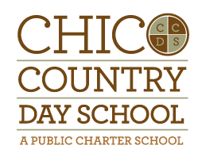

# Impacts on Society

This document describes a plan for the implementation on societies impacts by computation for a course to be implemented at Chico Country Day School. The plan for implementing the class overall can be found here: https://cs-ed.github.io/edtech-plan-NHunsicker/

 

[[https://www.chicocountryday.org/wp-content/uploads/ccds-color.png|width=200px]]

## Plan

### Learning Objectives

Describe the learning objectives for the class that relate to social impacts. Consider using Bloom's Taxonomy to identify the types of cognitive and/or affective outcomes (and their associated verbs): https://bloomstaxonomy.net/

### Learning Activities

Describe the learning activities and how they will be incorporated into the class. For example, will they include class discussion, written reports, homework, or exams? Will the activity be a one-time lesson or used multiple times in class?

### Assessment

Describe how you plan to assess the learning objectives described above.

### Outcomes

Describe how your plan will facilitate diversity/equity/inclusion and help broadening participation in computing. Also describe how the course plan will help long-term goals in addressing computing impacts on society.
